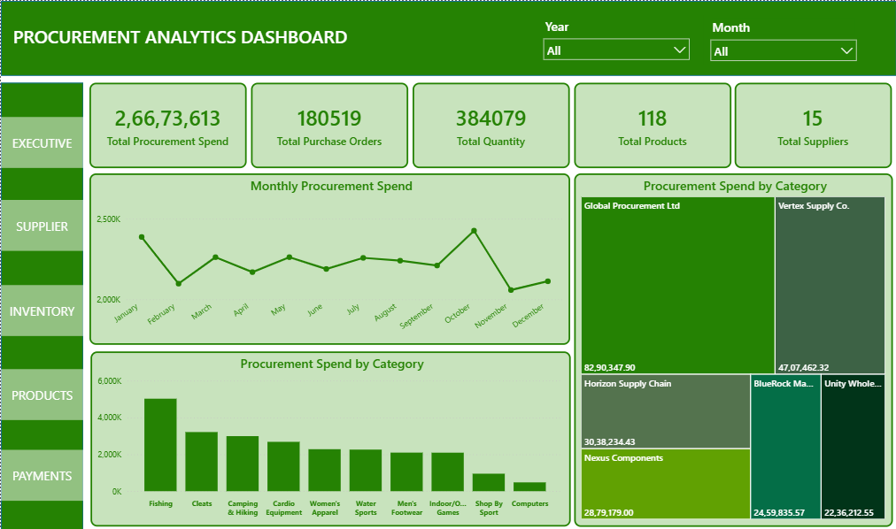
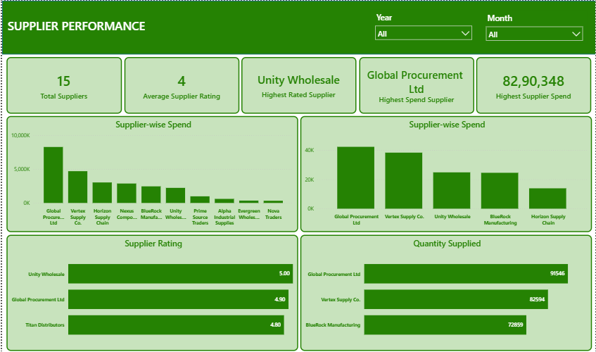
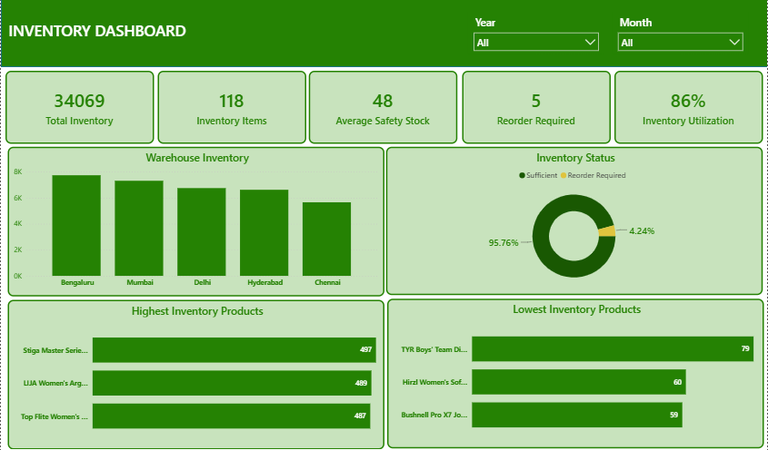
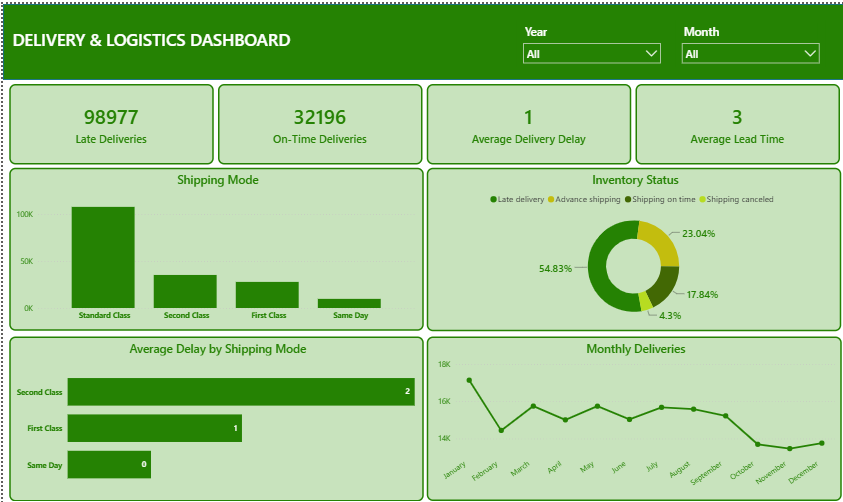
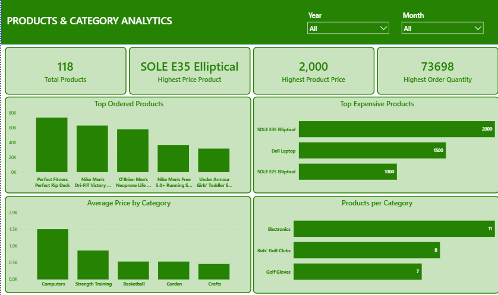
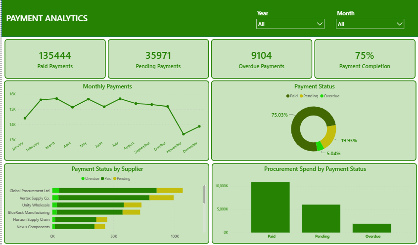

# 📦 Procurement & Supplier Performance Analytics

## 📌 Project Overview

This project analyzes procurement operations, supplier performance, inventory management, logistics, and payment trends using **Python, MySQL, and Power BI**. It transforms raw procurement transaction data into an interactive Business Intelligence dashboard that helps organizations monitor supplier efficiency, procurement costs, delivery performance, inventory health, and payment status.

The project follows a complete end-to-end data analytics workflow:

- Data Cleaning & Feature Engineering using Python
- Relational Database Design using MySQL
- SQL-based Business Analysis
- Interactive Dashboard Development using Power BI

---

# 🎯 Business Objective

The objective of this project is to provide procurement managers with actionable insights into supplier performance, procurement spending, inventory optimization, delivery efficiency, and payment tracking.

The dashboard helps answer business questions such as:

- Which suppliers contribute the highest procurement spend?
- Which suppliers perform the best?
- Which product categories drive procurement costs?
- How efficient is the delivery process?
- Which inventory items require replenishment?
- What is the payment status across procurement orders?

---

# 🛠 Tech Stack

- **Python**
  - Pandas
  - NumPy

- **MySQL**
  - Database Design
  - SQL Queries
  - Business Analysis

- **Power BI**
  - Dashboard Development
  - DAX
  - Data Modeling

- **Git & GitHub**
  - Version Control
  - Project Documentation

---

---

# 🗄 Database Schema

The project follows a normalized relational database design consisting of six tables:

- Suppliers
- Products
- Purchase Orders
- Inventory
- Payments
- Product Categories

Relationships are created using Primary Keys and Foreign Keys to ensure data integrity and efficient querying.

---

# 📊 Dashboard Overview

The Power BI dashboard consists of **6 interactive pages**.

---

## 1️⃣ Executive Dashboard

Provides an overview of procurement operations.

### KPIs

- Total Procurement Spend
- Total Purchase Orders
- Total Quantity Purchased
- Total Products
- Total Suppliers

### Visuals

- Monthly Procurement Spend Trend
- Procurement Spend by Category
- Supplier-wise Procurement Spend

---

## 2️⃣ Supplier Performance Dashboard

Analyzes supplier efficiency and procurement contribution.

### KPIs

- Total Suppliers
- Average Supplier Rating
- Highest Rated Supplier
- Highest Spend Supplier
- Highest Supplier Spend

### Visuals

- Supplier-wise Procurement Spend
- Supplier Ratings
- Quantity Supplied
- Top Suppliers by Spend

---

## 3️⃣ Inventory Dashboard

Monitors inventory levels and warehouse performance.

### KPIs

- Total Inventory
- Inventory Items
- Average Safety Stock
- Reorder Required
- Inventory Utilization

### Visuals

- Warehouse-wise Inventory
- Inventory Status Distribution
- Highest Inventory Products
- Lowest Inventory Products

---

## 4️⃣ Delivery & Logistics Dashboard

Evaluates logistics performance.

### KPIs

- Late Deliveries
- On-Time Deliveries
- Average Delivery Delay
- Average Lead Time

### Visuals

- Shipping Mode Distribution
- Delivery Status Distribution
- Average Delay by Shipping Mode
- Monthly Deliveries

---

## 5️⃣ Products & Category Analytics

Analyzes product and category performance.

### KPIs

- Total Products
- Highest Price Product
- Highest Product Price
- Highest Order Quantity

### Visuals

- Top Ordered Products
- Top Expensive Products
- Average Product Price by Category
- Products per Category

---

## 6️⃣ Payment Analytics

Tracks procurement payment performance.

### KPIs

- Paid Payments
- Pending Payments
- Overdue Payments
- Payment Completion %

### Visuals

- Monthly Payments
- Payment Status Distribution
- Payment Status by Supplier
- Procurement Spend by Payment Status

---

# 📈 Project Statistics

| Metric | Value |
|---------|--------|
| Purchase Orders | 180,519 |
| Products | 118 |
| Suppliers | 15 |
| Inventory Items | 118 |
| Payments | 180,519 |
| Total Procurement Spend | ₹26.67 Million |
| Total Quantity Purchased | 384,079 |
| Average Procurement Cost | ₹147.76 |
| Average Lead Time | 3.50 Days |
| Average Delivery Delay | 0.57 Days |

---

# 💡 Key Business Insights

- Processed and analyzed **180,519 procurement transactions** across **118 products** supplied by **15 suppliers**.
- Total procurement spend exceeded **₹26.67 Million**, with an average procurement cost of **₹147.76** per purchase order.
- **Global Procurement Ltd** recorded the highest procurement spend, making it the most valuable supplier.
- **Unity Wholesale** achieved the highest supplier performance rating.
- The **Fishing** category generated the highest procurement expenditure among all product categories.
- **Perfect Fitness Perfect Rip Deck** emerged as the most frequently ordered product with over **73,000 units** purchased.
- Only **5 products** required immediate replenishment, indicating strong inventory management practices.
- Approximately **75%** of procurement payments were completed successfully, while pending and overdue payments highlighted opportunities for improving payment efficiency.
- Standard Class shipping handled the majority of procurement orders, whereas Second Class experienced the highest average delivery delay.

---

# 📊 SQL Analysis

The project includes **40+ SQL business queries**, covering:

- Procurement KPIs
- Supplier Performance
- Vendor Ranking
- Procurement Spend Analysis
- Inventory Analysis
- Warehouse Analysis
- Product Performance
- Category Analysis
- Payment Analysis
- Delivery Performance
- Monthly Trends

---

# 📸 Dashboard Preview

## Executive Dashboard

---

## Supplier Performance Dashboard

---

## Inventory Dashboard

---

## Delivery & Logistics Dashboard

---

## Products & Category Analytics

---

## Payment Analytics

---

# 🚀 Skills Demonstrated

- Data Cleaning
- Feature Engineering
- SQL Database Design
- Data Modeling
- SQL Joins
- Aggregate Functions
- Window Functions
- Business KPI Development
- DAX
- Power BI Dashboard Design
- Procurement Analytics
- Supplier Performance Analysis
- Inventory Analytics
- Business Intelligence

---

# 🔮 Future Improvements

- Integrate real supplier master data instead of simulated supplier assignments.
- Connect Power BI directly to MySQL for automated dashboard refresh.
- Implement procurement demand forecasting using Machine Learning.
- Build supplier scorecards with weighted performance metrics.
- Add procurement budget vs actual spend analysis.
- Develop predictive inventory replenishment models.

---

# 👩‍💻 Author

**Vaishnavi Teli**

Aspiring Data Analyst | Business Intelligence Analyst

### Connect with me

- LinkedIn: *www.linkedin.com/in/vaishnavi-teli*
- GitHub: *VaishnaviTeli11*

---

⭐ **If you found this project useful, consider giving it a star!**